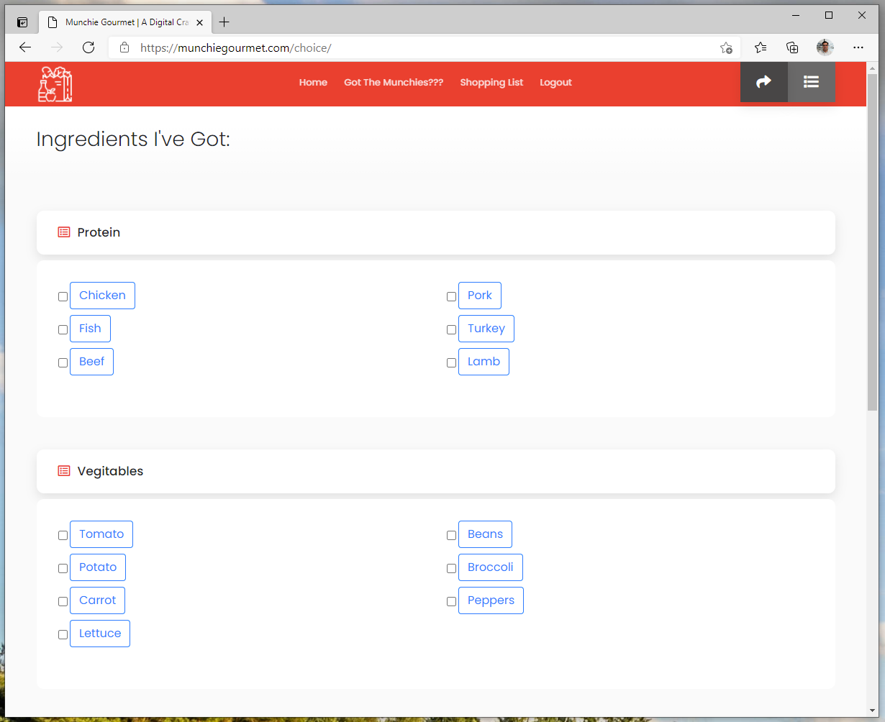
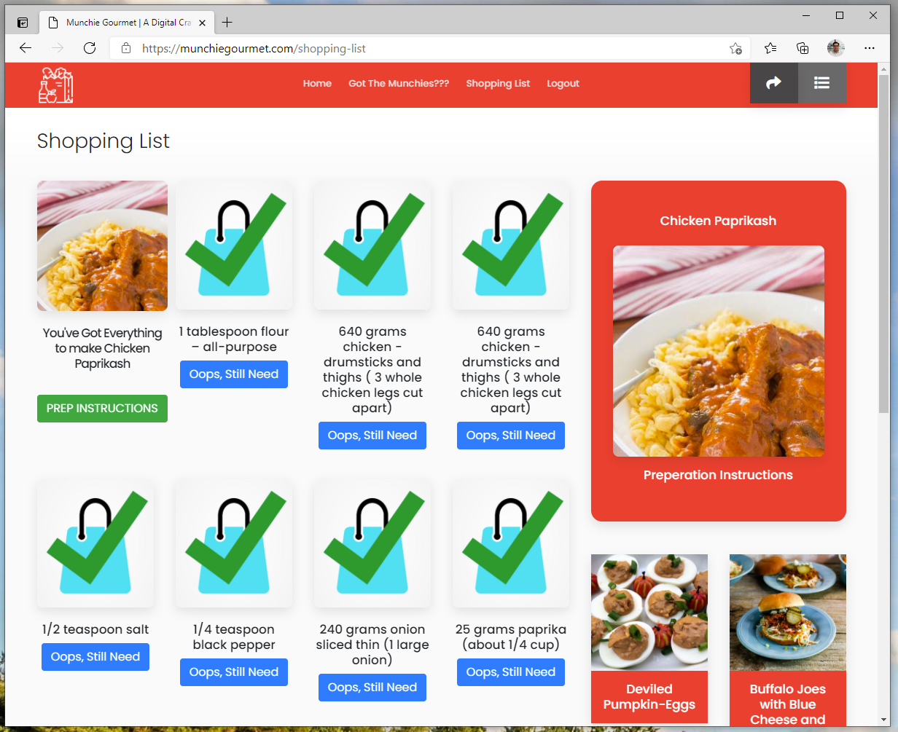
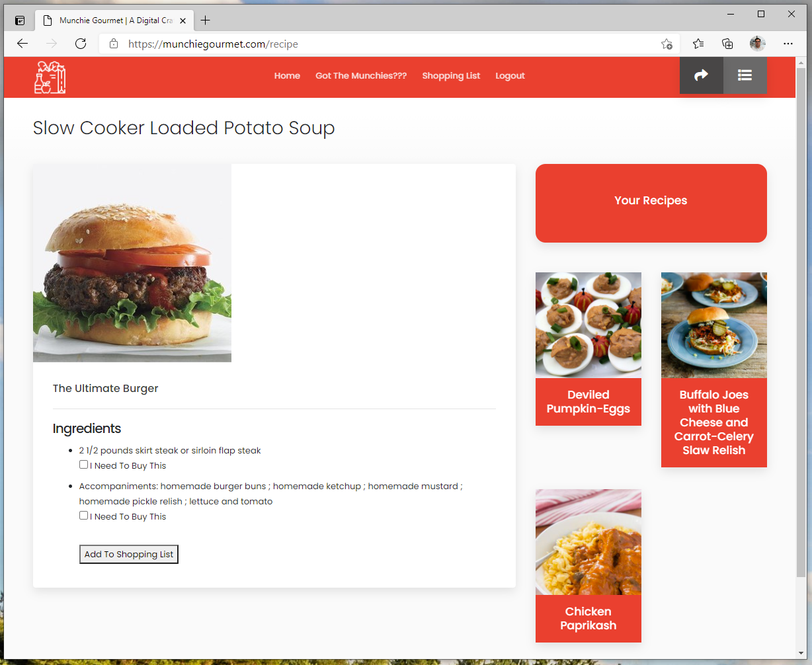
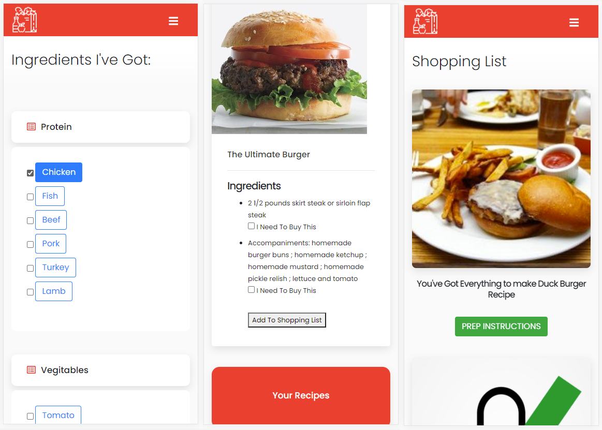

# Week9 - Second Group Project - Full Stack Java Script

## Munchie Gourmet
This group project had us heading for the fridge to find out what we can eat. We set up a form that lets you select the items you have in your kitchen, then it hits the API and you see recipes that include your item(s). You are most likely not going to have all the ingredients, so from the recipe page you can choose which ingredients you need to add to your shopping list and then you have a shopping list for heading off to the store to complete your ingredients list. Once you've moved all the ingredients to aquired, the recipe is displayed at the top of the shopping list with a link to the preperation instructions on an external website.

The original group project can be found [In This Repository](https://github.com/Murphy-ZJ/food-in-fridge)

## Upgrades
The orignal version did not have mobile friendly version of the page you choose your items. I changed the template page we were using and added buttons to make it easier to select on a mobile device.

The original version could only handle one recipe. I added a column to the users data base to track the current recipe/shopping list.

A unseen update was changing the database from PostgresSQL to mySQL. I also gave it a pretty home at [MunchieGourmet.com](https://munchiegourmet.com/)

